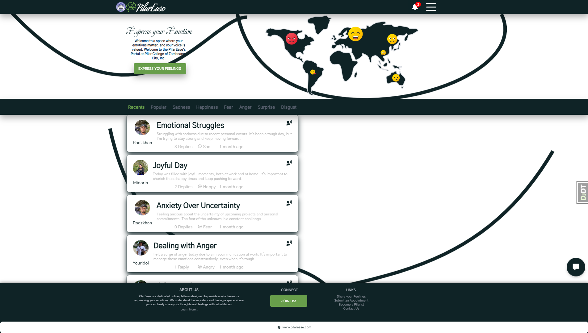

# PilarEaseDJO

PilarEaseDJO is a Django-based platform for emotion management and sentiment analysis, featuring user authentication, status posting, emotion filtering, machine learning integration, chatbot interaction, and administrative tools.

## Installation

1. Clone the repository:

    ```sh
    git clone https://github.com/KCprsnlcc/PilarEaseDJO.git
    ```

2. Navigate to the project directory:

    ```sh
    cd PilarEaseDJO
    ```

3. Install dependencies:

    ```sh
    pip install -r requirements.txt
    ```

4. Run migrations:

    ```sh
    python manage.py migrate
    ```

5. Start the development server:

    ```sh
    python manage.py runserver
    ```

6. Access the application at `http://localhost:8000`.

## Features

- **User Authentication & Management**: Allow users to register, log in, and manage their profiles.
- **Main Interface**: Dashboard for user interactions, including status posting and viewing.
- **Emotion Management**: Filter statuses based on emotions and perform sentiment analysis.
- **Chatbot Integration**: Interface for chatbot interaction.
- **Contact & Support**: Provide a contact form for user queries.
- **Administrative Tools**: Manage user profiles, view queries and analysis, and export analysis data.

## Contributing

Contributions are welcome! Please follow the [Contribution Guidelines](CONTRIBUTING.md).

## License

This project is licensed under the [License](LICENSE.md).

## Support

For any inquiries or issues, please contact [kcpersonalacc@gmail.com](mailto:kcpersonalacc@gmail.com).

---

**Note:** This project is still in development. Some features may not be fully implemented or may change as the project evolves.