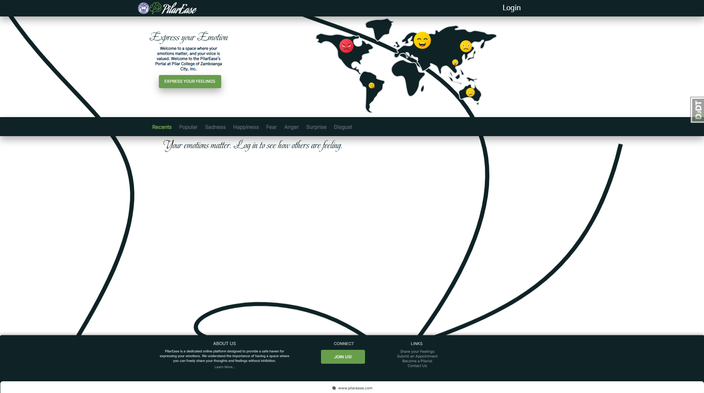
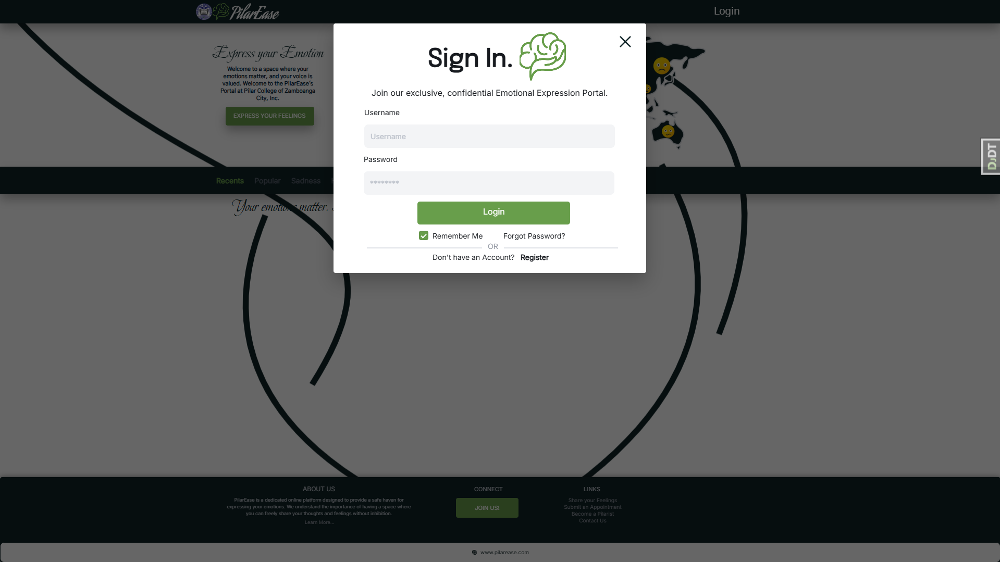
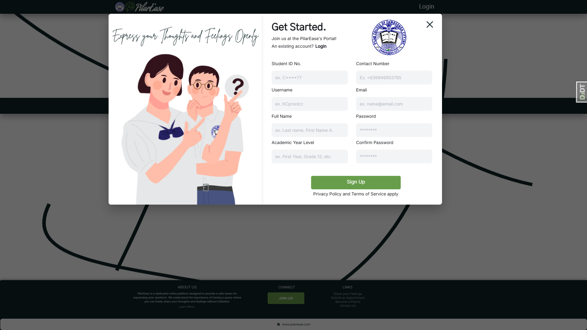
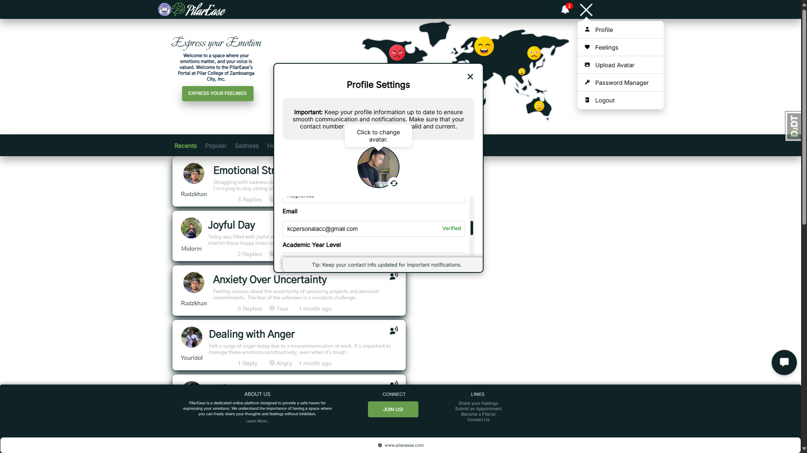
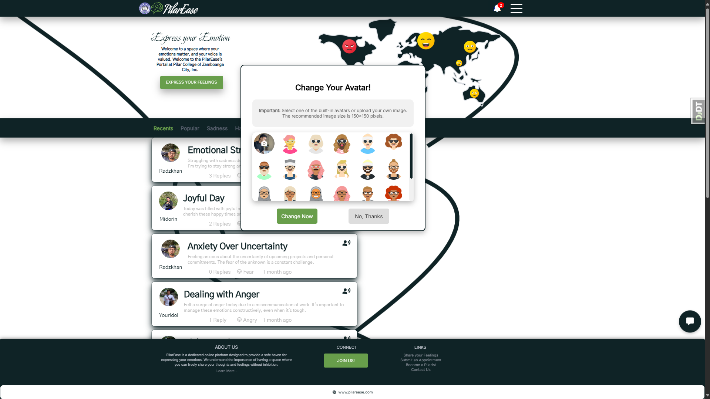
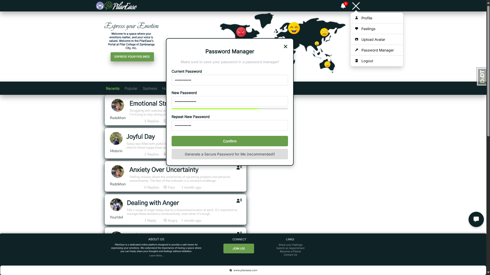
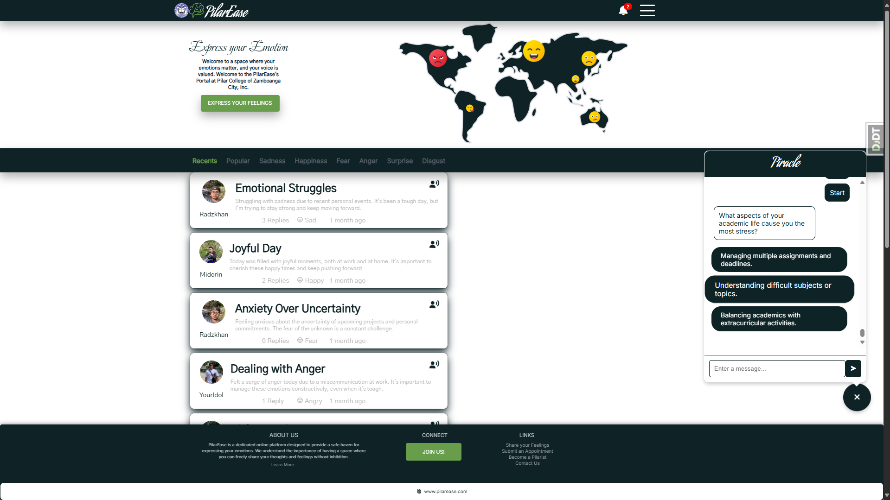
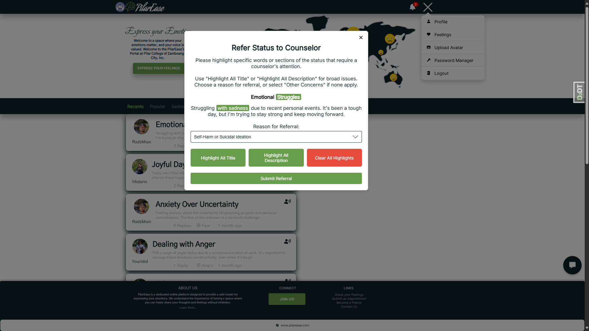
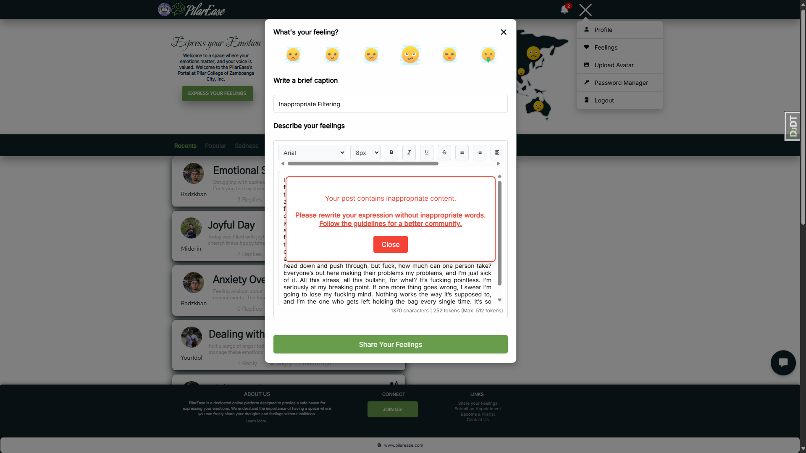

# PilarEaseDJO

<div align="center">
    
    <p><b>PilarEase - An Emotional Support Platform for Pilar College students, providing resources and a supportive community to foster emotional well-being.</b></p>
</div>

## 📱 Interface Preview

<div align="center">
  <table>
    <tr>
      <td align="center">
        
        <p><b>PilarEase Home</b></p>
      </td>
      <td align="center">
        
        <p><b>Login Interface</b></p>
      </td>
      <td align="center">
        
        <p><b>Register Interface</b></p>
      </td>
    </tr>
    <tr>
      <td align="center">
        
        <p><b>Profile Setting</b></p>
      </td>
      <td align="center">
        
        <p><b>Avatar Options</b></p>
      </td>
      <td align="center">
        
        <p><b>Password Manager</b></p>
      </td>
    </tr>
    <tr>
      <td align="center">
        
        <p><b>Chat Interaction</b></p>
      </td>
      <td align="center">
        
        <p><b>Manage Referral</b></p>
      </td>
      <td align="center">
        
        <p><b>Profanity Filtering</b></p>
      </td>
    </tr>
  </table>
</div>

## 🔍 Overview

PilarEaseDJO is a Django-based emotional support platform designed specifically for Pilar College students. The platform combines modern web technologies with machine learning to provide a safe, supportive environment where students can express themselves, receive guidance, and access mental health resources.

Key components include:

- Emotion-based status sharing with sentiment analysis
- AI-powered chatbot for emotional assessment and support
- Profanity filtering and content moderation
- Counselor referral system for professional support
- Administrative tools for the ITRC team

---

## ⚙️ Installation

### Prerequisites

- Python 3.8+
- Supabase account (PostgreSQL)
- Git

### 1. Clone the Repository

```sh
git clone https://github.com/KCprsnlcc/PilarEaseDJO.git
cd PilarEaseDJO
```

### 2. Set Up Virtual Environment

**For macOS/Linux:**

```sh
python3 -m venv .venv
source .venv/bin/activate
```

**For Windows:**

```sh
# Optional: Set PowerShell execution policy
Set-ExecutionPolicy RemoteSigned -Scope Process -Force

# Create and activate virtual environment
python -m venv .venv
.venv\Scripts\activate
```

### 3. Install Dependencies

```sh
pip install -r requirements.txt --progress-bar on
```

### 4. Configure Database

Set up a Supabase project and configure your environment variables.

The application connects to Supabase using direct API integration. Create a `.env` file in your project root with the following variables (replace with your Supabase credentials):

```
# Supabase credentials
SUPABASE_URL=your_supabase_url
SUPABASE_KEY=your_supabase_key

# Django settings
SECRET_KEY=your_django_secret_key
DEBUG=True

# Email settings
EMAIL_HOST=smtp.gmail.com
EMAIL_PORT=587
EMAIL_HOST_USER=your_email@gmail.com
EMAIL_HOST_PASSWORD=your_app_password
EMAIL_USE_TLS=True
```

### 5. Apply Database Migrations

```sh
python manage.py migrate
```

### 6. Start Development Server

```sh
python manage.py runserver
```

### 7. Access the Application

Open your browser and navigate to:

```
http://localhost:8000
```

### 8. Docker Deployment (Alternative)

You can also use Docker for deployment:

```sh
docker-compose up --build
```

---

## ✨ Features

### 🔐 User Authentication & Management

<table>
  <tr>
    <td width="50%"><strong>Secure Login/Logout</strong></td>
    <td width="50%">Session tracking with audit trails and secure session termination</td>
  </tr>
  <tr>
    <td><strong>Smart Registration</strong></td>
    <td>Enrollment masterlist verification with auto/manual approval workflows</td>
  </tr>
  <tr>
    <td><strong>Password Recovery</strong></td>
    <td>Email-based reset with rate limiting and expiring tokens</td>
  </tr>
  <tr>
    <td><strong>Email Verification</strong></td>
    <td>Account verification and email change management</td>
  </tr>
</table>

### 👤 User Profile & Personalization

<table>
  <tr>
    <td width="50%"><strong>Profile Management</strong></td>
    <td width="50%">Update personal details, contact info, and academic information</td>
  </tr>
  <tr>
    <td><strong>Password Security</strong></td>
    <td>Secure password updates with current password verification</td>
  </tr>
  <tr>
    <td><strong>Customizable Avatars</strong></td>
    <td>Upload and select from various avatar options with validation</td>
  </tr>
  <tr>
    <td><strong>Session Analytics</strong></td>
    <td>Track login sessions and device information</td>
  </tr>
</table>

### 🏠 Interface & Navigation

<table>
  <tr>
    <td width="50%"><strong>Modern UI/UX</strong></td>
    <td width="50%">Intuitive navigation with responsive design</td>
  </tr>
  <tr>
    <td><strong>Information Pages</strong></td>
    <td>About page with platform details and testimonials</td>
  </tr>
  <tr>
    <td><strong>Contact System</strong></td>
    <td>User inquiry submission with admin review functionality</td>
  </tr>
  <tr>
    <td><strong>Dynamic Dashboard</strong></td>
    <td>Personalized activity feed with status updates and analytics</td>
  </tr>
</table>

### 📝 Status & Content Management

<table>
  <tr>
    <td width="50%"><strong>Emotion-Based Posting</strong></td>
    <td width="50%">Share statuses with automatic emotion analysis</td>
  </tr>
  <tr>
    <td><strong>Content Moderation</strong></td>
    <td>AI-powered profanity filtering and inappropriate content detection</td>
  </tr>
  <tr>
    <td><strong>Categorized Views</strong></td>
    <td>Filter content by recency, popularity, or emotional categories</td>
  </tr>
  <tr>
    <td><strong>Counselor Referrals</strong></td>
    <td>Flag concerning content for professional review</td>
  </tr>
</table>

### 🤖 Emotional Intelligence & Chatbot

<table>
  <tr>
    <td width="50%"><strong>Sentiment Analysis</strong></td>
    <td width="50%">ML-powered emotion detection with detailed breakdown</td>
  </tr>
  <tr>
    <td><strong>Interactive Chatbot</strong></td>
    <td>Guided emotional assessment with adaptive questioning</td>
  </tr>
  <tr>
    <td><strong>Response Validation</strong></td>
    <td>Smart response processing with follow-up recommendations</td>
  </tr>
  <tr>
    <td><strong>Chat History</strong></td>
    <td>Interaction logs with pagination</td>
  </tr>
</table>

### 🧠 AI & Machine Learning

<table>
  <tr>
    <td width="50%"><strong>Emotion Classification</strong></td>
    <td width="50%">Transformer-based model for accurate emotion detection</td>
  </tr>
  <tr>
    <td><strong>Content Safety</strong></td>
    <td>Multi-layered profanity filtering with custom dictionaries</td>
  </tr>
  <tr>
    <td><strong>Sentiment Scoring</strong></td>
    <td>Analyze feedback and user content for tone and intent</td>
  </tr>
</table>

### 🔔 Notifications & Activity Tracking

<table>
  <tr>
    <td width="50%"><strong>Real-time Alerts</strong></td>
    <td width="50%">Instant notifications for interactions and updates</td>
  </tr>
  <tr>
    <td><strong>Activity Feed</strong></td>
    <td>Chronological display of status replies and interactions</td>
  </tr>
  <tr>
    <td><strong>Preference Settings</strong></td>
    <td>Customizable notification options with highlight system</td>
  </tr>
</table>

### 🛠️ Administrative Tools

<table>
  <tr>
    <td width="50%"><strong>Admin Dashboard</strong></td>
    <td width="50%">Control panel with secure access</td>
  </tr>
  <tr>
    <td><strong>User Verification</strong></td>
    <td>Review and approval workflows</td>
  </tr>
  <tr>
    <td><strong>Bulk Operations</strong></td>
    <td>Efficient management of multiple accounts simultaneously</td>
  </tr>
  <tr>
    <td><strong>Enrollment Management</strong></td>
    <td>Upload and manage student enrollment data</td>
  </tr>
  <tr>
    <td><strong>Audit System</strong></td>
    <td>Detailed activity logging for administrative actions</td>
  </tr>
</table>

### 👩‍⚕️ Counselor Support System

<table>
  <tr>
    <td width="50%"><strong>Referral Dashboard</strong></td>
    <td width="50%">Organized interface for managing student referrals</td>
  </tr>
  <tr>
    <td><strong>Interaction Review</strong></td>
    <td>Access to chatbot histories for assessment</td>
  </tr>
  <tr>
    <td><strong>Appointment Scheduling</strong></td>
    <td>Calendar integration for counseling sessions</td>
  </tr>
</table>

### 📊 Analytics & Reporting

<table>
  <tr>
    <td width="50%"><strong>Engagement Metrics</strong></td>
    <td width="50%">User activity and session analytics</td>
  </tr>
  <tr>
    <td><strong>Emotional Insights</strong></td>
    <td>Visual representations of emotion trends and distributions</td>
  </tr>
  <tr>
    <td><strong>Usage Reports</strong></td>
    <td>Exportable data for institutional reporting</td>
  </tr>
</table>
## 🚀 Deployment

### Local Deployment

Follow the installation instructions above to set up a local development environment.

### Docker Deployment

A `Dockerfile` and `docker-compose.yml` are provided for containerized deployment with Supabase integration:

```sh
# Make sure your .env file contains the required variables (SUPABASE_URL, SUPABASE_KEY, etc.)
docker-compose up --build
```

### Railway Deployment

This project is configured for deployment on Railway with `railway.json` configuration.

## 🔧 Technology Stack

- **Backend**: Django 5.0+, Python 3.8+
- **Database**: PostgreSQL (via Supabase)
- **Frontend**: HTML5, CSS3, JavaScript, Bootstrap
- **AI/ML**: Hugging Face Transformers, NLTK, TextBlob
- **Containerization**: Docker
- **Security**: Django security middleware, CSRF protection, rate limiting

## 👥 Contributing

Contributions are welcome! Please see [CONTRIBUTING.md](CONTRIBUTING.md) for guidelines.

## 📄 License

This project is licensed under the MIT License - see [LICENSE.md](LICENSE.md) for details.

## 📞 Support

For support or inquiries, please contact the development team at pilarease@pilarcollege.edu.

### 11. System Notifications & Alerts for ITRC Staff

- **Custom Notifications**: Admins can broadcast notifications for all users or selected groups.
- **Notification History**: Maintains a log of all sent notifications for reference and audit.
- **Email and SMS Alerts**: Sends email and SMS notifications for significant user actions (e.g., password resets, account status changes).

### 12. User Demographic Insights

- **Role-Based Insights**: Distribution of user roles (e.g., ITRC staff, counselor, student) for system demographics.
- **Verification Status Overview**: Tracks user verification statuses (verified, pending, rejected).

---

## Contributing

Contributions are welcome! Please refer to the [Contribution Guidelines](CONTRIBUTING.md) for details.

---

## License

This project is licensed under the terms outlined in the [License](LICENSE.md).

---

## Support

For inquiries or issues, please contact [kcpersonalacc@gmail.com](mailto:kcpersonalacc@gmail.com).

---

**Note:** PilarEase is under active development, and features may evolve as enhancements and fixes are applied.
