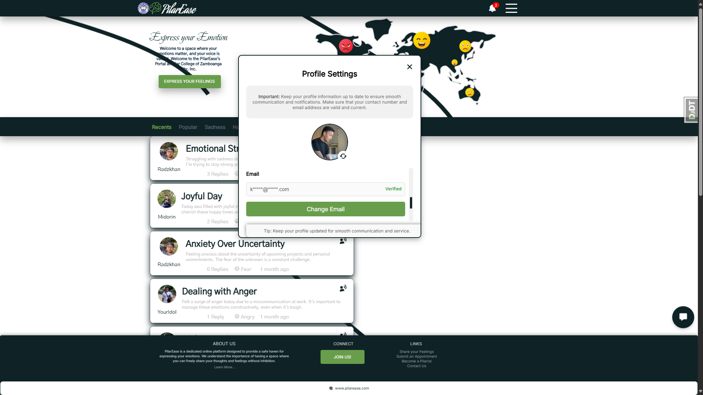

# PilarEaseDJO

<div align="center">
  <table>
    <tr>
      <td align="center">
        
        <p><b>PilarEase Home</b></p>
      </td>
      <td align="center">
        
        <p><b>Login Interface</b></p>
      </td>
      <td align="center">
        
        <p><b>Register Interface</b></p>
      </td>
    </tr>
    <tr>
      <td align="center">
        
        <p><b>Profile Setting</b></p>
      </td>
      <td align="center">
        
        <p><b>Avatar Options</b></p>
      </td>
      <td align="center">
        
        <p><b>Password Manager</b></p>
      </td>
    </tr>
     <tr>
      <td align="center">
        
        <p><b>Chat Interaction</b></p>
      </td>
      <td align="center">
        
        <p><b>Manage Referral</b></p>
      </td>
      <td align="center">
        
        <p><b>Profanity Filtering</b></p>
      </td>
    </tr>
  </table>
</div>

PilarEaseDJO is a Django-based platform for emotion management and sentiment analysis, featuring user authentication, status posting, emotion filtering, machine learning integration, chatbot interaction, and administrative tools.

## Installation

### 1. **Clone the Repository**

First, clone the PilarEaseDJO repository from GitHub:

```sh
git clone https://github.com/KCprsnlcc/PilarEaseDJO.git
```

Navigate to the project directory:

```sh
cd PilarEaseDJO
```

### 2. **Set up a Python Virtual Environment**

It is highly recommended to use a Python virtual environment to manage dependencies and avoid conflicts with other Python projects.

#### For macOS/Linux:

1. **Create the virtual environment:**

   ```sh
   python3 -m venv .venv
   ```

2. **Activate the virtual environment:**

   ```sh
   source .venv/bin/activate
   ```

#### For Windows:

1. **Set the PowerShell execution policy (Optional):**

   If you're using PowerShell on Windows, you may need to change the execution policy to allow the script to run:

   ```sh
   Set-ExecutionPolicy RemoteSigned -Scope Process -Force
   ```

2. **Create the virtual environment:**

   ```sh
   python -m venv .venv
   ```

3. **Activate the virtual environment:**

   ```sh
   .venv\Scripts\activate
   ```

### 3. **Install Dependencies**

Once the virtual environment is activated, install the required dependencies listed in the `requirements.txt` file.

Use the following command for both macOS/Linux and Windows:

```sh
pip install -r requirements.txt --progress-bar on
```

### 4. **Apply Database Migrations**

Next, set up the database by applying the necessary migrations:

```sh
python manage.py migrate
```

### 5. **Start the Development Server**

Once the migrations are applied, you can start the Django development server with this command:

```sh
python manage.py runserver
```

### 6. **Access the Application**

Open your web browser and navigate to:

```
http://localhost:8000
```

### 7. **Deactivate the Virtual Environment (Optional)**

When you're done working in the virtual environment, you can deactivate it using:

#### For macOS/Linux:

```sh
deactivate
```

#### For Windows:

```sh
deactivate
```

## Features

### 1. User Authentication & Management

- **Logins**: Allows users to log in using their credentials. Includes session management to maintain user login state.
- **Register**: Enables new users to create an account with validated input data saved to the database.
- **Forgot Password**: Provides a mechanism for users to reset their password via email.
- **Masterlist Verification**: Verifies user credentials against master list data during registration or login.

### 2. User Profile Management

- **User Profile Interface**: Allows users to view and update their profile information.
- **Password Management**: Enables users to manage and update their passwords securely.
- **Upload Avatar**: Allows users to upload and update their profile pictures.
- **Email Verification**: Provides functionality for users to verify their specific email address through an email verification link. Once verified, the user's profile will show a 'Verified' badge, improving security and trust.

### 3. Main Interface

- **Dashboard**: Provides a main interface for user interactions, including posting and viewing statuses.
- **About Interface**: Includes an informational page providing details about the portal.

### 4. Status Management

- **Status Posting**: Allows users to post updates. Includes a content filter to detect and block inappropriate content.
- **View Status**: Enables users to view statuses posted by themselves and others.
- **Reply to Status**: Allows users to reply to statuses, with replies saved to the database.
- **Referral Module**: Allows users to refer and report inappropriate statuses directly to a counselor for review. The counselor can block inappropriate content or take further action as needed.

### 5. Emotion Management

- **Emotion Filter Category**: Provides options to filter statuses based on different emotions for targeted viewing.

### 6. Data Collection

- **Emotion Dataset Collection**: Collects data on expressed emotions in English.

### 7. Machine Learning Integration

- **Pre-trained Model Collection**: Integrates suitable pre-trained models for emotion analysis.
- **Fine-Tuning Pre-trained Model**: Fine-tunes emotion analysis models using Tagalog datasets.
- **Analysis Model Deployment**: Deploys the fine-tuned sentiment analysis model within the portal.

### 8. Chatbot Integration

- **Chatbot Interface**: Provides an interface for chatbot interaction using an expert system with backward chaining, allowing smooth transitions between bot and live counselor interactions.
- **Chatbot Model Deployment**: Ensures real-time interaction and the seamless operation of the chatbot.

### 9. Contact & Support

- **Contact Interface**: Allows users to send messages via a contact form routed to administrators.
- **Message Queries**: Implements a system for users to send and receive responses to their queries.

### 10. Administrative Tools

- **View Text Message Queries**: Enables administrators to view user queries.
- **Emotion Category Search Filtering**: Allows filtering of searches by emotion categories.
- **Analysis Search Filtering**: Provides options to filter sentiment analysis results.
- **View Text Analysis Results**: Displays detailed sentiment analysis results for review.
- **Counselor Chat Interface**: Collects all questions and answers from chatbot interactions and allows counselors to chat in real-time with users. This interface enables counselors to manage and respond to reported statuses and provide personalized support.
- **Manage Users**: Includes tools for managing user profiles, including deactivation, deletion, and editing.
- **Manage Referral**: Allows administrators to manage user referrals for specific statuses. Administrators can view referred statuses, review reported issues, and take action (e.g., removing inappropriate content or contacting users for clarification).
- **Download Analysis Data**: Allows exporting of sentiment analysis data in CSV format.

## Contributing

Contributions are welcome! Please follow the [Contribution Guidelines](CONTRIBUTING.md).

## License

This project is licensed under the [License](LICENSE.md).

## Support

For any inquiries or issues, please contact [kcpersonalacc@gmail.com](mailto:kcpersonalacc@gmail.com).

---

**Note:** This project is still in development. Some features may not be fully implemented or may change as the project evolves.
