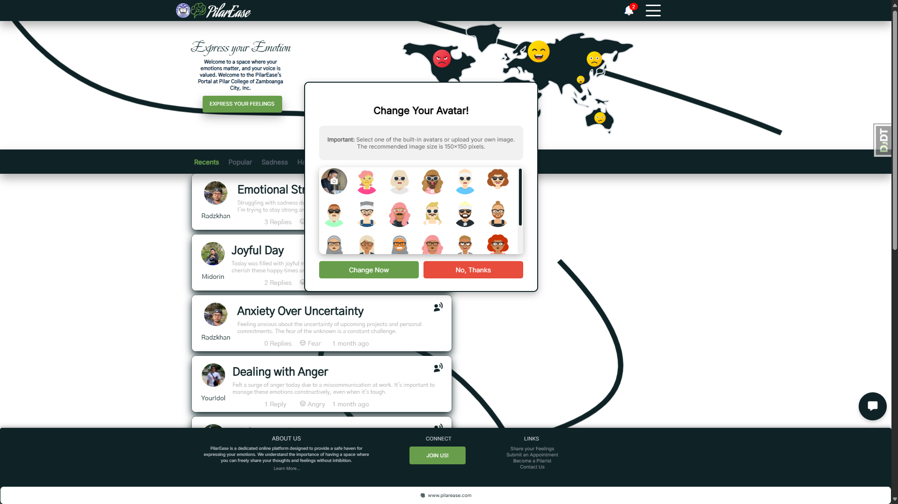

# PilarEaseDJO

<div align="center">
    
    <p><b>PilarEase - An Emotional Support Platform for Pilar College students, providing resources and a supportive community to foster emotional well-being.</b></p>
</div>

<div align="center">
  <table>
    <tr>
      <td align="center">
        
        <p><b>PilarEase Home</b></p>
      </td>
      <td align="center">
        
        <p><b>Login Interface</b></p>
      </td>
      <td align="center">
        
        <p><b>Register Interface</b></p>
      </td>
    </tr>
    <tr>
      <td align="center">
        
        <p><b>Profile Setting</b></p>
      </td>
      <td align="center">
        
        <p><b>Avatar Options</b></p>
      </td>
      <td align="center">
        
        <p><b>Password Manager</b></p>
      </td>
    </tr>
    <tr>
      <td align="center">
        
        <p><b>Chat Interaction</b></p>
      </td>
      <td align="center">
        
        <p><b>Manage Referral</b></p>
      </td>
      <td align="center">
        
        <p><b>Profanity Filtering</b></p>
      </td>
    </tr>
  </table>
</div>

PilarEaseDJO is a Django-based emotional support platform designed to help Pilar College students manage their emotional well-being. The platform provides features such as emotion-based status posting, sentiment analysis, chatbot assistance, and administrative tools. PilarEase leverages machine learning to create a supportive and secure environment for students.

---

## Installation

### 1. Clone the Repository

To begin, clone the PilarEaseDJO repository:

```sh
git clone https://github.com/KCprsnlcc/PilarEaseDJO.git
cd PilarEaseDJO
```

### 2. Set Up a Python Virtual Environment

It’s recommended to use a Python virtual environment to manage dependencies:

#### For macOS/Linux:

```sh
python3 -m venv .venv
source .venv/bin/activate
```

#### For Windows:

Optionally, set the PowerShell execution policy:

```sh
Set-ExecutionPolicy RemoteSigned -Scope Process -Force
```

Create and activate the virtual environment:

```sh
python -m venv .venv
.venv\Scripts\activate
```

### 3. Install Dependencies

Install the dependencies listed in `requirements.txt`:

```sh
pip install -r requirements.txt --progress-bar on
```

### 4. Apply Database Migrations

Set up the database by applying migrations:

```sh
python manage.py migrate
```

### 5. Start the Development Server

Launch the Django development server:

```sh
python manage.py runserver
```

### 6. Access the Application

Open a web browser and navigate to:

```
http://localhost:8000
```

### 7. Deactivate the Virtual Environment (Optional)

When finished, deactivate the virtual environment:

```sh
deactivate
```

---

## Features

### 1. User Authentication & Management

- **Login/Logout**: Secure login with session tracking and logout features, including session end auditing.
- **Registration**: User registration with masterlist verification, supporting auto-verification, manual approval, or rejection based on the enrollment masterlist.
- **Forgot Password**: Password reset through email verification and rate-limiting to prevent spam.
- **Email Verification**: Users can verify email addresses and request email changes, including verification link expiry management.

### 2. User Profile Management

- **Profile Editing**: Users can update their profile information, including usernames, contact numbers, and academic year levels.
- **Password Management**: Provides a secure password update with current password verification.
- **Avatar Upload**: Supports customizable avatars with file size validation and storage.
- **Session Tracking**: Tracks user sessions for analytics and session-based actions.

### 3. Main Interface

- **Home & About Pages**: Provides access to main platform features, including testimonials on the About page.
- **Contact Us**: Users can submit inquiries, which are saved for admin review.
- **Dashboard**: Displays recent activity, statuses, and analytics.

### 4. Status Management

- **Status Posting**: Allows users to post statuses, with custom profanity filtering, text sanitization, and emotion analysis.
- **Status Moderation**: Admins can delete statuses flagged as inappropriate.
- **View Statuses by Categories**: Filter statuses based on categories like recent, popular, or emotion-based categories.
- **Referral Module**: Allows users to flag content for counselor review, with referral options for content highlighting.

### 5. Emotion & Chat Management

- **Emotion-Based Status Analysis**: Each status is analyzed for emotional tone, with a breakdown of emotion scores such as anger, happiness, sadness, etc.
- **Chatbot Questionnaire**: Users can initiate a guided emotional assessment using a chatbot, with customizable questions, response validation, and counselor referral options.
- **Chat History & Analytics**: Includes chat history pagination, tracking user progress, and storing bot responses.

### 6. Data Collection & Machine Learning Integration

- **Emotion Model**: Integrates a pre-trained transformer model for emotion classification, supporting emotion percentages.
- **Profanity Filtering**: Uses both built-in and custom profanity lists for content moderation.
- **Feedback Analysis**: User feedback is analyzed with sentiment scores for auto-approval of positive feedback.

### 7. Notifications & Recent Activity

- **Notification System**: Tracks user interactions, including status updates, replies, and flagged content, providing alerts in real-time.
- **Recent Activity Feed**: Displays recent replies to user statuses and other interactions.
- **Notification Settings**: Users can customize notification preferences, and unread notifications are highlighted.

### 8. ITRC Administrative Tools

- **Admin Authentication**: Admin-only login, audit-logging, and session tracking.
- **Verification Dashboard**: ITRC staff can review and approve user verification requests manually or automatically.
- **Bulk Actions**: ITRC staff can bulk-verify, activate, deactivate, or delete user accounts as needed.
- **Masterlist Uploads**: Enables admins to upload, review, and filter enrollment masterlists to manage student accounts.
- **Audit Log**: Comprehensive logging of admin actions, including user modifications, setting updates, and role assignments.

### 9. Counselor Features

- **Referral Management**: Counselors can review and respond to user referrals flagged for support.
- **User Chat Review**: Counselors have access to user-chatbot interaction history to assess and provide further assistance if needed.

### 10. Analytics & Reports

- **User Activity Analytics**: Tracks logins, daily activity, and session metrics for user engagement insights.
- **Emotion Analysis Reports**: Graphical emotion distribution breakdowns on statuses and interactions.
- **Feedback Analysis**: Visualization of feedback sentiment (positive, neutral, negative) for quality assurance.
- **System Performance Metrics**: API response times, error rates, and system uptime analysis.
- **Report Download**: PDF download options for offline report viewing of all key analytics.

### 11. System Notifications & Alerts for ITRC Staff

- **Custom Notifications**: Admins can broadcast notifications for all users or selected groups.
- **Notification History**: Maintains a log of all sent notifications for reference and audit.
- **Email and SMS Alerts**: Sends email and SMS notifications for significant user actions (e.g., password resets, account status changes).

### 12. User Demographic Insights

- **Role-Based Insights**: Distribution of user roles (e.g., ITRC staff, counselor, student) for system demographics.
- **Verification Status Overview**: Tracks user verification statuses (verified, pending, rejected).

---

## Contributing

Contributions are welcome! Please refer to the [Contribution Guidelines](CONTRIBUTING.md) for details.

---

## License

This project is licensed under the terms outlined in the [License](LICENSE.md).

---

## Support

For inquiries or issues, please contact [kcpersonalacc@gmail.com](mailto:kcpersonalacc@gmail.com).

---

**Note:** PilarEase is under active development, and features may evolve as enhancements and fixes are applied.
